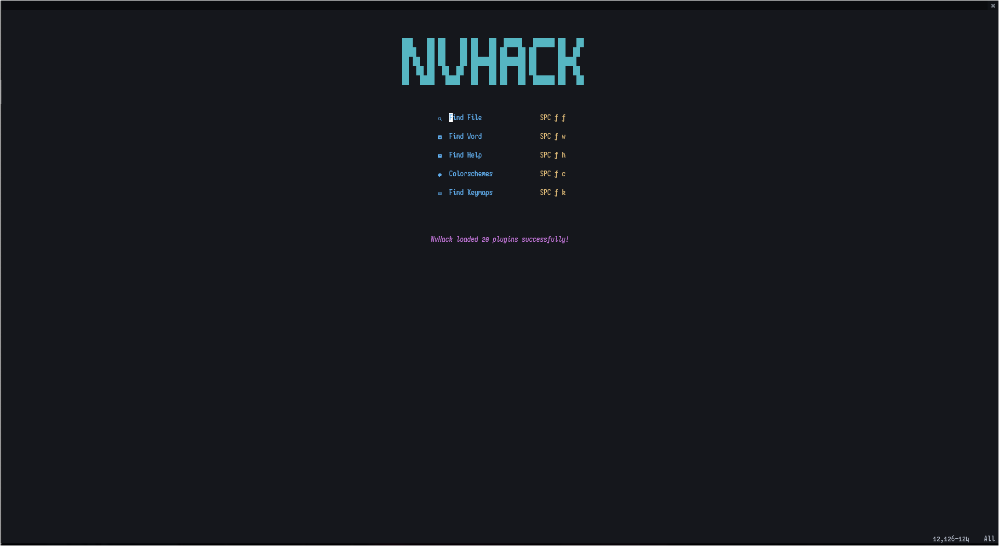
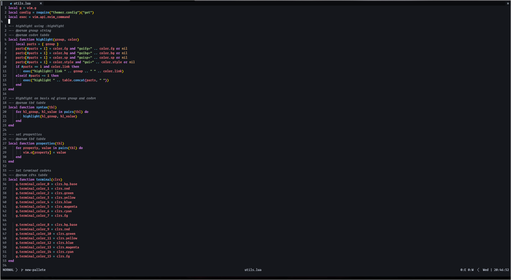

# astron.nvim

### About

A dark colorscheme based on [Onedark](https://github.com/joshdick/onedark.vim)

### Showcase



### Features

- Support for multiple plugins :)
- Bold and italic support
- Customizable

### Requirements

- Neovim >= 0.5.0

### Installation

Install the theme with your preferred package manager:

[packer](https://github.com/wbthomason/packer.nvim)

```lua
use 'bryant-the-coder/astron.nvim'
```

[vim-plug](https://github.com/junegunn/vim-plug)

```vim
Plug 'bryant-the-coder/astron.nvim'
```

### Configurationsa
> Configuration needs to be set **BEFORE** loading the color scheme with `colorscheme substrata`

| Option                     | Default   | Description              |
| -------------------------- | --------- | ------------------------ |
| astron_italic_comments  | `true`    | Make comments italic     |
| astron_italic_keywords  | `false`   | Make keywords italic     |
| astron_italic_booleans  | `false`   | Make booleans italic     |
| astron_italic_functions | `false`   | Make functions italic    |
| astron_italic_variables | `false`   | Make variables italic    |

```lua
-- Example in lua :)
vim.g.astron_italic_comments = true

vim.cmd[[colorscheme astron]]
```

```vim
" Example config in Vim Script
let g:astron_italic_functions = 1

" Load the colorscheme
colorscheme astron
```

### Credits
This theme won't be create if it wasnt because of this wonderful peoples colorscheme

- [Onedark](https://github.com/joshdick/onedark.vim) for the inspiration
- [Onedark.nvim](https://github.com/LunarVim/onedarker.nvim) by Chris@Machine
- [substrata](https://github.com/kvrohit/substrata.nvim)
- [AstroVim](https://github.com/kabinspace/AstroVim)
> The author has written this colorscheme and I have permission to borrow this theme and modify it. The author will also use this colorscheme in the future
- [themer.lua](https://github.com/ThemerCorp/themer.lua) for their code as a screenshots
